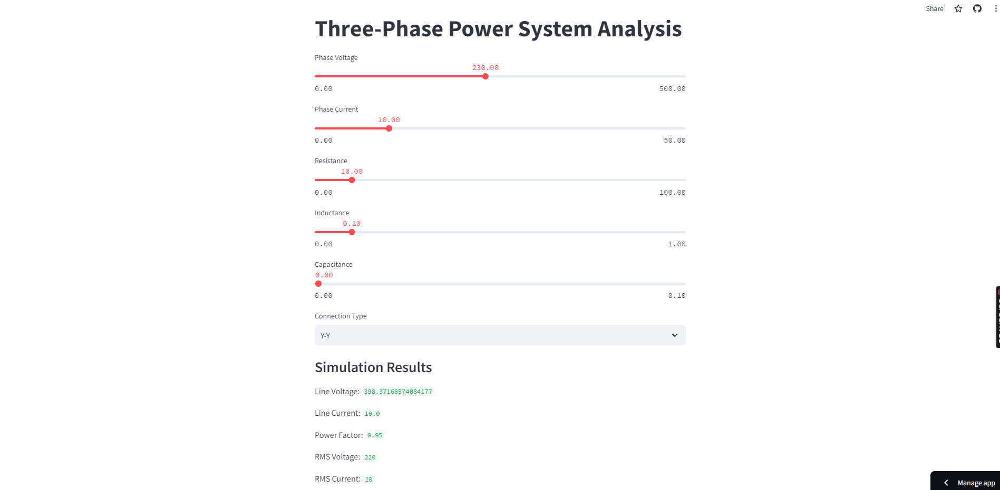

# 3phasesystem-analysis
Overview

This project is a simulator for three-phase power systems implemented in Python using the Streamlit framework. The simulator allows users to analyze different types of three-phase connections (Y-Y, Y-D, D-Y, D-D) and calculate phase and line voltages.
Features:
    Connection Types: Supports Y-Y, Y-D, D-Y, and D-D three-phase connections.
    Voltage Calculations: Calculates phase and line voltages based on user input.
    Interactive Interface: Provides an interactive interface for easy configuration and analysis.
    Real-Time Feedback: Displays simulation results in real-time for immediate analysis.

Installation
-Clone this repository to your local machine:
git clone https://github.com/your_username/three-phase-system-simulator.git

-Navigate to the project directory:
cd three-phase-system-simulator

-Install the required dependencies:   pip install -r requirements.txt

Usage :1. Run the Streamlit app:
 streamlit run app.py

2.Open the provided URL in your web browser to access the simulator.
https://3phase-analysis-asb.streamlit.app/

3.Configure the three-phase system by selecting the connection type and adjusting the input sliders.

4.View the simulation results, including phase and line voltages, in real-time.

5.Analyze the results to verify calculations or experiment with different configurations.

Example
Below is a screenshot of the simulator interface:

